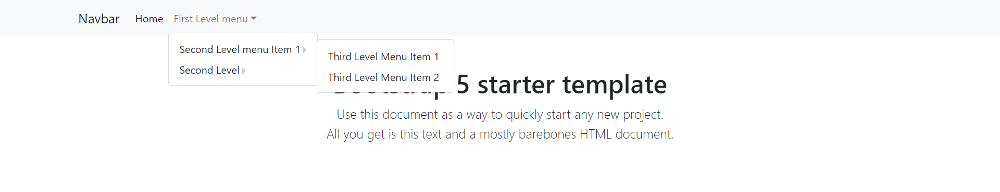
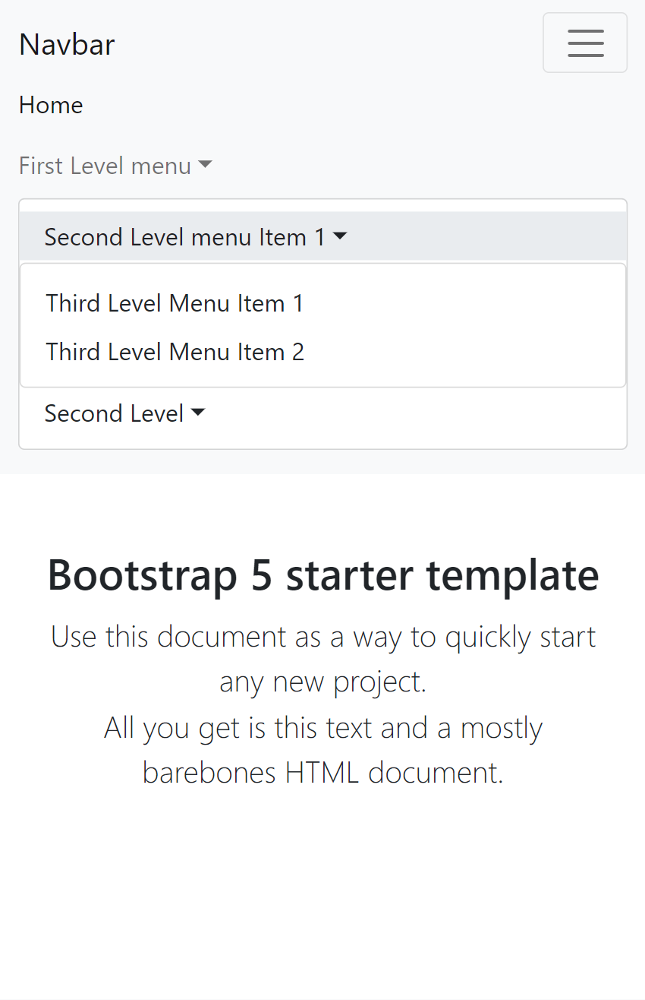

# bs5-navwalker
Bootstrap 5 WordPress navbar walker  
added support for level 3 items
- Alex created the first nav-walker for Bootstrap 5 
- modified by Charly 
- modified by Manish
   
  
  

 
<ul>
<li>Step 1: define 'depth' => 3, in header.php</li>
<li>Step 2: replace navbar.php</li>
<li>Step 3: add css, written in custom.css</li>
</ul>